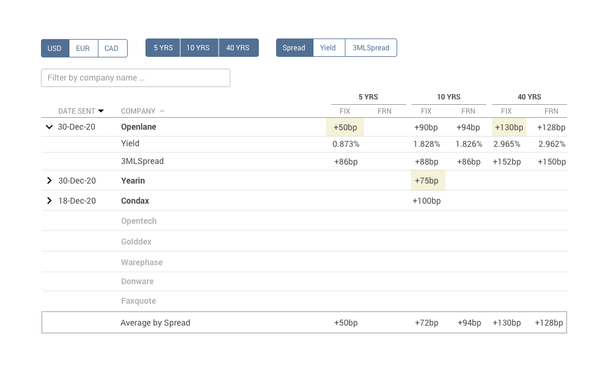

## InterPrice Technologies Developer Test

Create Vue component from [mockup.jpg](mockup.jpg) for displaying data from [data.json](interprice-test/src/data/data.json). Put the component in the public repository (Gilab, Github, Bitbucket).

### Features of the Component

- **Currency** switcher can dynamically toggle currencies returned from `data.json` (single currency at once, default is `USD`). Please notice that the set of currencies is not fixed and depends on the data from `data.json`.
- **Years** switcher can dynamically toggle the years (from `data.json`) **calculated** for selected currency (multi-selection is possible, defaults - all years for the currency are selected). The set of years _depends on currency_.
- Table data also depends on the `display` parameter (like _Spread_, _Yield_ and _3MLSpread_). Only one can be selected at once
- Table rows can be dynamically filtered by company name
- Table rows are sorted by **Date sent** field by default, then by **Preferred** flag.
- Rows with empty **Quote** field should be displayed below the rows with non-empty **Quote** fields.
- Each row by default should display value from the field defined by `display` switcher (ie _Spread_, _Yield_ or _3MLSpread_).
- Each row has dropdown control icon, which expands / collapses secondary rows for current row (by click). These sub-rows should display values from the fields, which were not selected by `display` switcher. For instance, if _Spread_ is selected, then secondary rows should contain _Yield_ and _3MLSpread_ values.
- Table rows can be sorted by **Date Sent** or **Company Name** columns.
- Last row should contain **average values** (by years) for selected `display` parameter.
- Minimal values (by column) of each primary row should be highlighted.

### Format values

- Dates should be formatted as `DD-MMM-YY`
- _Spread_ and _3MLSpread_ values should be formatted as integers prefixed by `+` sign for positive numbers and contain `bp` as a suffix.
- _Yield_ values should be formatted as floats (3 digits after decimal point) and contain `%` suffix

### Technical requirements

- `"vue": "^2.7.7"`
- component markup: `Bootstrap` or any CSS framework of your choice (Bulma, Tailwind etc.)
- can contain additional components
- can use Vuex (optional)

### Time expectations

We expect the test will take 4-8 hours normally, but **time is not restricted** and can be enhanced.

_Thank you for participating! We'll be happy to work together! Good luck!_
